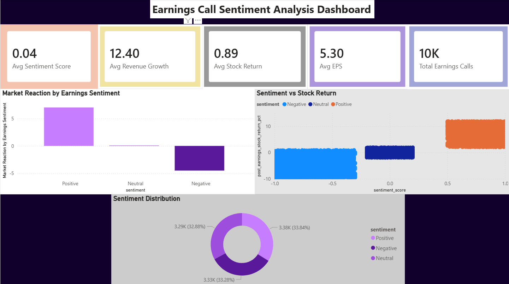

# Earnings Call Sentiment Analysis Dashboard

## Overview

This project explores the relationship between earnings call sentiment and post-earnings stock performance.

Using Python, SQL, and Power BI, I created a synthetic dataset of 10,000 earnings call records and analyzed how positive, neutral, and negative sentiment may influence market reactions.

---

## Tools Used

- Python
- Pandas
- Jupyter Notebook
- SQLite
- Power BI

---

## Dataset Features

The dataset includes:

- Company
- Ticker
- Earnings Date
- Quarter
- Sentiment
- Sentiment Score
- Revenue Growth %
- EPS
- Market Volatility Index
- Post-Earnings Stock Return %

---

## Project Workflow

1. Generated and prepared earnings call data using Python.
2. Performed exploratory data analysis using Pandas.
3. Stored and queried data using SQLite.
4. Analyzed relationships between sentiment and stock returns.
5. Built an interactive Power BI dashboard for visualization.

---

## Dashboard Highlights

- KPI Cards for key metrics
- Market Reaction by Sentiment
- Sentiment vs Stock Return Analysis
- Sentiment Distribution
- Interactive filtering and exploration

---

## Key Insight

Positive earnings call sentiment generally aligned with stronger post-earnings stock returns, while negative sentiment showed weaker market performance.

---

## Dashboard Preview

### Executive Dashboard

---

## What I Learned

This project helped me improve my skills in:

- Data cleaning and transformation
- Exploratory data analysis
- SQL querying
- Dashboard development
- Business storytelling with data

---

## Future Improvements

- Use real earnings call transcripts
- Apply FinBERT for sentiment scoring
- Build predictive machine learning models
- Deploy an interactive web application
